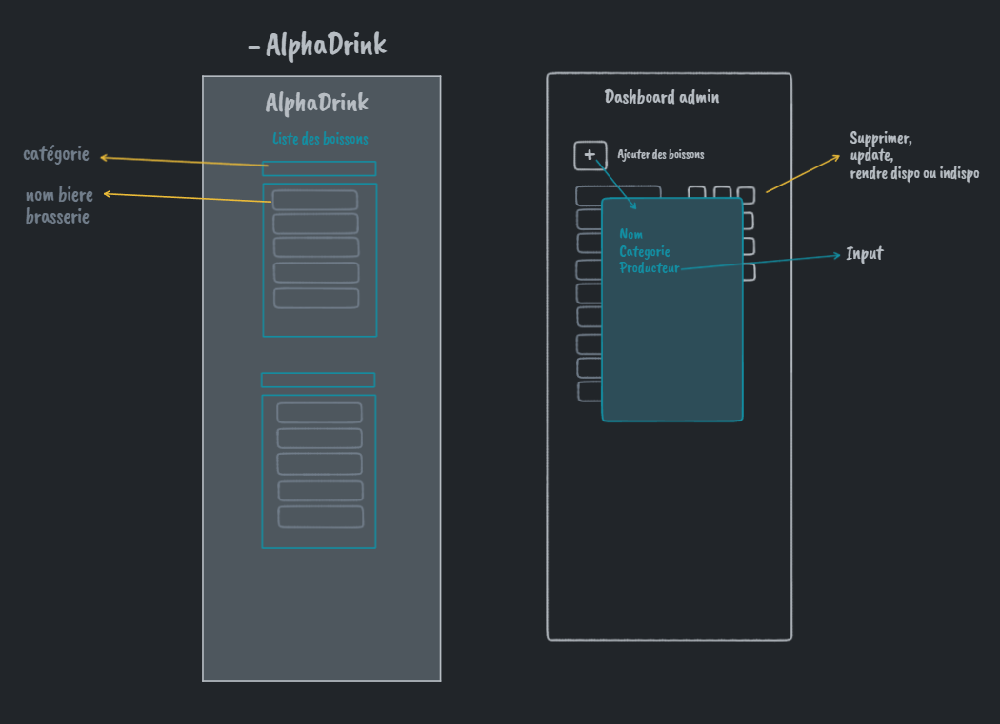

# 2 - Wireframe

## Pages

Pour commencer, le projet devait démarrer sur 3 pages :

- La page d'accueil qui doit présenter la liste des boissons
- La page de connexion pour l'administrateur
- Le dashboard de l'administrateur permettant le CRUD des boissons

2 pages ont été ajoutées pour faciliter la gestions des modales et éviter de plus nombreux fichiers javascript en Front.

- La page de chaque boisson
- La page de chaque boisson vue par l'admin pour les modifications

## Visuel

Le wireframe a été réalisé sur les pages de départ prévues initialement.

A noter : Sur la page d'accueil, il n'y aura pas de bouton de connexion puisque la fonctionnalité de création de compte et de connexion pour un utilisateur n'est pas retenue dans la v1. La connexion de l'administrateur se fera via une url directe.

[Précédent](1-Brainstorming.md) | [Accueil](0-Sommaire.md) | [Suivant](3-Use-cases.md)