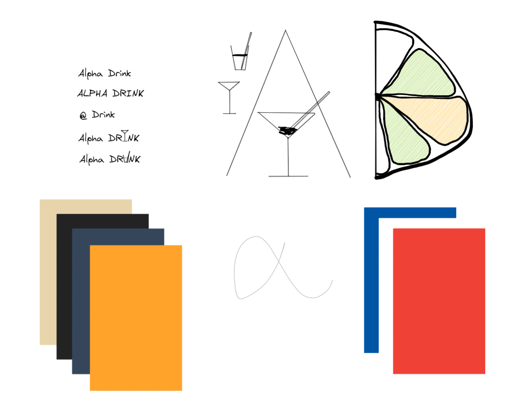
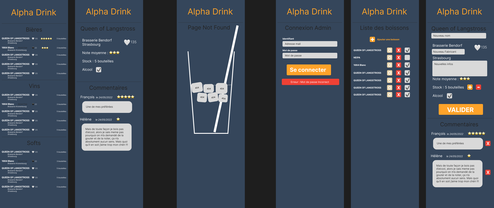

# 5 - Mood Board

## Premiers jets

Le but de ce premier jet était de mettre sur papier les premières idées qi me venait.
Afin d'avoir une v1 disponible rapidement, je n'ai pas crée de logo de et vrai identité visuelle. La v2 sera consacrée à cela avec l'ajout de nouvelles fonctionnalités.

J'aimerais jouer sur le jeu de mot `Alpha Drink` / `Alpha Drunk` en jouant sur le type de verre qui viendra prendre place au milieu du mot.
J'ai réfléchi a une idée de logo autour d'un `A` dans lequel la barre centrale serait un verre à martini, et un `D` qui serait un citron coupé.

## Maquette v1

Voilà la première version que j'aimerais rendre. L'interface se voudra suffisament simple pour ressembler à une carte de restaurant.

[Précédent](4-MCD-MLD-MPD.md) | [Accueil](0-Sommaire.md) | [Suivant](6-TODO.md)